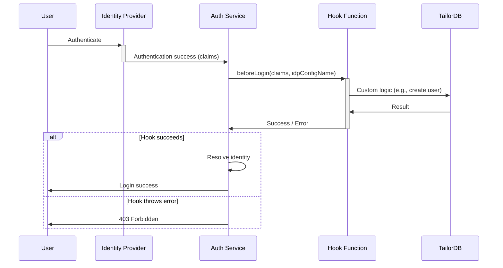

# Auth Hooks

Auth Hooks allow you to run custom logic during authentication flows. By registering hook handlers, you can execute Functions at specific points in the login process — for example, to perform Just-In-Time (JIT) user provisioning or validate claims before a user is granted access.

Currently, the following hook is supported:

- **beforeLogin**: Runs after IdP authentication succeeds but before identity resolution

## Before Login Hook

The `beforeLogin` hook is invoked after the Identity Provider authenticates a user but before the Auth service resolves the user's identity. This gives you the opportunity to inspect the IdP claims and take action — such as creating a user record if one doesn't exist yet.

### Use Cases

- **JIT User Provisioning**: Automatically create user records in TailorDB when a user logs in for the first time
- **Claim Validation**: Verify that the authenticated user meets specific criteria before allowing login

## Execution Flow



## Configuration

Configure the `beforeLogin` hook in `defineAuth` using the `hooks` property:

```typescript
import { defineAuth, idp, secrets } from "@tailor-platform/sdk";
import { user } from "./tailordb/user";
import { beforeLoginHandler } from "./functions/beforeLogin";

const auth = defineAuth("my-auth", {
  idProvider: idp.oidc("my-idp", {
    clientId: "<client-id>",
    clientSecret: secrets.value("default", "oidc-client-secret"),
    providerUrl: "<your_auth_provider_url>",
  }),
  userProfile: {
    type: user,
    usernameField: "email",
    attributes: { roles: true },
  },
  machineUsers: {
    "hook-invoker": {
      attributes: { role: "ADMIN" },
    },
  },
  hooks: {
    beforeLogin: {
      handler: beforeLoginHandler,
      invoker: "hook-invoker",
    },
  },
});
```

| Property                   | Description                                                                                                     |
| -------------------------- | --------------------------------------------------------------------------------------------------------------- |
| **hooks**                  | Object containing hook configurations.                                                                          |
| **hooks.beforeLogin**      | Configuration for the before-login hook.                                                                        |
| - handler                  | Reference to the Function that handles the hook **(required)**.                                                  |
| - invoker                  | Name of the machine user used to invoke the handler **(required)**. Must be defined in `machineUsers`.           |

The `invoker` machine user is used by the Auth service to call the handler Function. Ensure this machine user has sufficient permissions to perform the operations needed inside the handler (e.g., creating user records in TailorDB).

## Handler Arguments

The hook handler receives the following arguments:

| Argument          | Type   | Description                                                        |
| ----------------- | ------ | ------------------------------------------------------------------ |
| **claims**        | object | The claims returned by the Identity Provider (e.g., email, name).  |
| **idpConfigName** | string | The name of the IdP configuration that authenticated the user.     |

## Example: JIT User Provisioning

The following handler creates a user record in TailorDB when a user logs in for the first time:

```typescript {{title:'functions/beforeLogin.ts'}}
import { fn } from "@tailor-platform/sdk";

export const beforeLoginHandler = fn.handler(
  "beforeLoginHandler",
  async ({ args }) => {
    const { claims } = args;

    const claimName = claims.name;
    if (!claimName) {
      throw new Error("name claim is required");
    }

    // JIT provisioning: create user record in TailorDB if not exists
    const client = new tailordb.Client({ namespace: "my-db" });
    await client.connect();
    await client.queryObject(
      `INSERT INTO User (email, name, role)
       VALUES ($1, $2, 'USER')
       ON CONFLICT (email) DO NOTHING`,
      [claimName, claimName]
    );
    await client.end();
  }
);
```

## Error Handling

| Scenario                      | Behavior                                                                |
| ----------------------------- | ----------------------------------------------------------------------- |
| Handler returns successfully  | Login continues with normal identity resolution.                        |
| Handler throws an error       | Login is aborted with a **403 Forbidden** response.                     |
| No hook configured            | Hook is skipped; login proceeds normally.                               |
| Infrastructure failure        | Login is aborted with a **503 Service Unavailable** response.           |

## Next Steps

- [Auth Service Overview](/guides/auth/overview) — Learn about the full Auth service capabilities
- [Functions Guide](/guides/function/overview) — Learn how to write and deploy Functions
- [Setting up Auth](/tutorials/setup-auth/overview) — Step-by-step tutorial for configuring authentication
