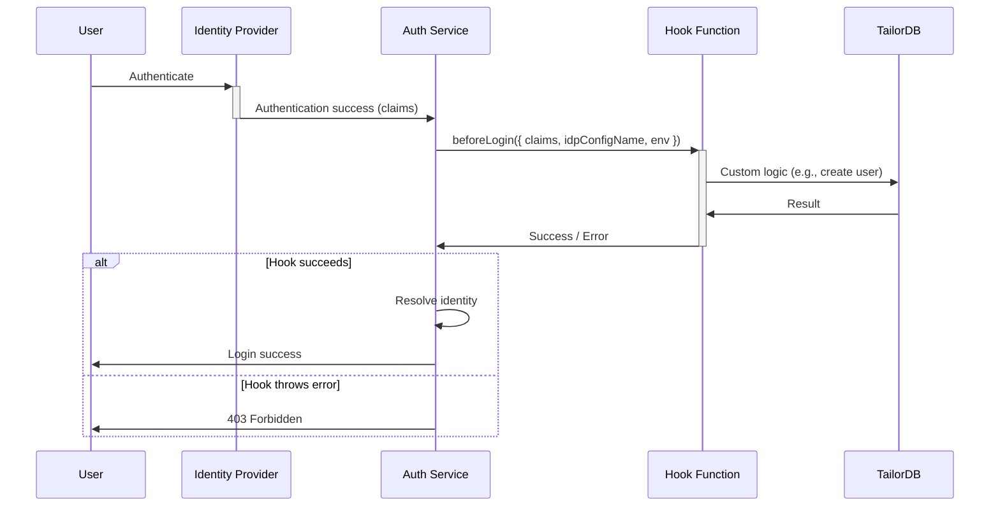

# Auth Hooks

Auth Hooks allow you to run custom logic during authentication flows. By registering hook handlers, you can execute Functions at specific points in the login process — for example, to perform Just-In-Time (JIT) user provisioning or validate claims before a user is granted access.

Currently, the following hook is supported:

- **beforeLogin**: Runs after IdP authentication succeeds but before identity resolution

## Before Login Hook

The `beforeLogin` hook is invoked after the Identity Provider authenticates a user but before the Auth service resolves the user's identity. This gives you the opportunity to inspect the IdP claims and take action — such as creating a user record if one doesn't exist yet.

### Use Cases

- **JIT User Provisioning**: Automatically create user records in TailorDB when a user logs in for the first time
- **Claim Validation**: Verify that the authenticated user meets specific criteria before allowing login

## Execution Flow


```mermaid
sequenceDiagram
  participant User
  participant IdP as Identity Provider
  participant Auth as Auth Service
  participant Hook as Hook Function
  participant DB as TailorDB

  User->>+IdP: Authenticate
  IdP->>-Auth: Authentication success (claims)
  Auth->>+Hook: beforeLogin({ claims, idpConfigName, env })
  Hook->>DB: Custom logic (e.g., create user)
  DB->>Hook: Result
  Hook->>-Auth: Success / Error
  alt Hook succeeds
    Auth->>Auth: Resolve identity
    Auth->>User: Login success
  else Hook throws error
    Auth->>User: 403 Forbidden
  end
```

## Configuration

Configure the `beforeLogin` hook in `defineAuth` using the `hooks` property:

```typescript
import { defineAuth, idp, secrets } from "@tailor-platform/sdk";
import { user } from "./tailordb/user";

const auth = defineAuth("my-auth", {
  idProvider: idp.oidc("my-idp", {
    clientId: "<client-id>",
    clientSecret: secrets.value("default", "oidc-client-secret"),
    providerUrl: "<your_auth_provider_url>",
  }),
  userProfile: {
    type: user,
    usernameField: "email",
    attributes: { roles: true },
  },
  machineUsers: {
    "hook-invoker": {
      attributes: { role: "ADMIN" },
    },
  },
  hooks: {
    beforeLogin: {
      handler: async ({ claims, idpConfigName }) => {
        // Your custom logic here
      },
      invoker: "hook-invoker",
    },
  },
});
```

| Property                   | Description                                                                                                     |
| -------------------------- | --------------------------------------------------------------------------------------------------------------- |
| **hooks**                  | Object containing hook configurations.                                                                          |
| **hooks.beforeLogin**      | Configuration for the before-login hook.                                                                        |
| - handler                  | Reference to the Function that handles the hook **(required)**.                                                  |
| - invoker                  | Name of the machine user used to invoke the handler **(required)**. Must be defined in `machineUsers`.           |

The `invoker` machine user is used by the Auth service to call the handler Function. Ensure this machine user has sufficient permissions to perform the operations needed inside the handler (e.g., creating user records in TailorDB).

## Handler Arguments

The hook handler receives the following arguments:

| Argument          | Type   | Description                                                        |
| ----------------- | ------ | ------------------------------------------------------------------ |
| **claims**        | object | The claims returned by the Identity Provider (e.g., email, name). For Built-in IdP federated logins, also carries [`federated_identity`](#federated-identity-claims). |
| **idpConfigName** | string | The name of the IdP configuration that authenticated the user.     |
| **env**           | object | Environment variables defined in `defineConfig({ env })` (the same values available via `context.env` in resolvers). |

## Federated Identity Claims

When a user signs in through a [Built-in IdP](/guides/auth/integration/built-in-idp) OAuth provider (Google or Microsoft), the upstream provider's profile is forwarded to the hook on `claims.federated_identity`. A common use is to populate the user record from the provider's profile during [JIT provisioning](#example-jit-user-provisioning).

`claims.federated_identity` is `undefined` for any non-federated login (for example, password logins or external IdP flows), so guard before reading it.

| Field        | Type                       | Description                                                                                                                                                                            |
| ------------ | -------------------------- | ------------------------------------------------------------------------------------------------------------------------------------------------------------------------------------ |
| **provider** | `"google" \| "microsoft"`  | The upstream OAuth provider that federated the login.                                                                                                                                |
| **claims**   | object                     | Profile claims from the provider's ID token. Commonly present claims (`name`, `given_name`, `family_name`, `picture`, `locale`) are available; any other claim the provider issues is forwarded as-is. |

Claim availability varies by provider. For example, Microsoft does not issue `picture`.

```typescript
hooks: {
  beforeLogin: {
    handler: async ({ claims }) => {
      const federated = claims.federated_identity;
      if (federated?.provider === "google") {
        // Populate the user record from the upstream profile
        const avatarUrl = federated.claims.picture;
      }
    },
    invoker: "hook-invoker",
  },
}
```

:::tip
`claims.federated_identity` is a login-flow signal available only inside the `beforeLogin` hook. It is not part of the app-facing session token. Persist whatever your app needs into your own TailorDB type during the hook.
:::

:::warning
`federated_identity` is populated on a user's next federated login. Profiles for users who logged in before this feature are not backfilled, because the upstream claims were never stored.
:::

## Example: JIT User Provisioning

The following example configures a `beforeLogin` hook inline in `defineAuth` that creates a user record in TailorDB when a user logs in for the first time:

```typescript
import { defineAuth, idp, secrets } from "@tailor-platform/sdk";
import { user } from "./tailordb/user";

const auth = defineAuth("my-auth", {
  idProvider: idp.oidc("my-idp", {
    clientId: "<client-id>",
    clientSecret: secrets.value("default", "oidc-client-secret"),
    providerUrl: "<your_auth_provider_url>",
  }),
  userProfile: {
    type: user,
    usernameField: "email",
    attributes: { roles: true },
  },
  machineUsers: {
    "hook-invoker": {
      attributes: { role: "ADMIN" },
    },
  },
  hooks: {
    beforeLogin: {
      handler: async ({ claims, idpConfigName }) => {
        const claimName = claims.name;
        if (!claimName) {
          throw new Error("name claim is required");
        }

        // JIT provisioning: create user record in TailorDB if not exists
        const client = new tailordb.Client({ namespace: "my-db" });
        await client.connect();
        await client.queryObject(
          `INSERT INTO User (email, name, role)
           VALUES ($1, $2, 'USER')
           ON CONFLICT (email) DO NOTHING`,
          [claimName, claimName]
        );
        await client.end();
      },
      invoker: "hook-invoker",
    },
  },
});
```

## Error Handling

| Scenario                      | Behavior                                                                |
| ----------------------------- | ----------------------------------------------------------------------- |
| Handler returns successfully  | Login continues with normal identity resolution.                        |
| Handler throws an error       | Login is aborted with a **403 Forbidden** response.                     |
| No hook configured            | Hook is skipped; login proceeds normally.                               |
| Infrastructure failure        | Login is aborted with a **503 Service Unavailable** response.           |

## Next Steps

- [Auth Service Overview](/guides/auth/overview) — Learn about the full Auth service capabilities
- [Functions Guide](/guides/function/overview) — Learn how to write and deploy Functions
- [Setting up Auth](/tutorials/setup-auth/overview) — Step-by-step tutorial for configuring authentication
