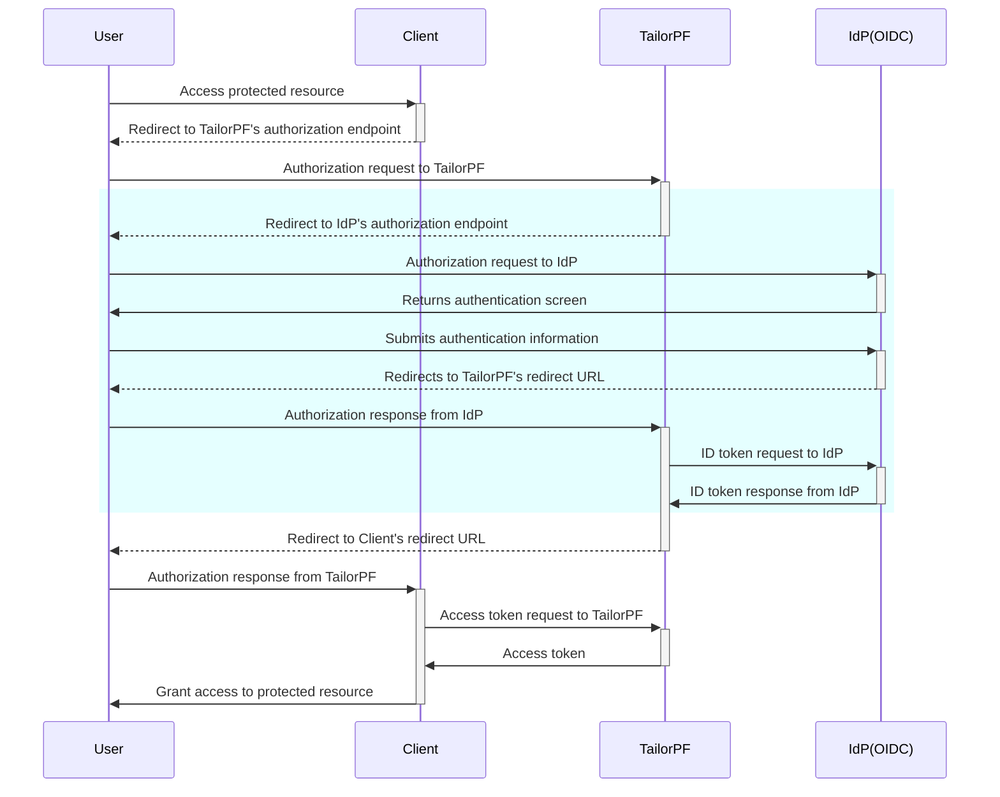
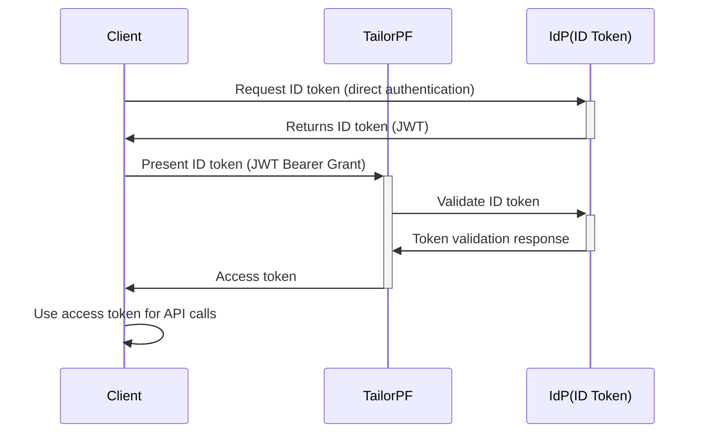

# Auth Service

The Auth service is a comprehensive authentication and authorization solution that enables secure user management and access control for your Tailor Platform applications. It provides seamless integration with external Identity Providers (IdPs) and manages user profiles, roles, and permissions within your application ecosystem.

## Key Capabilities

- **Single Sign-On (SSO) Integration**: Connect with external Identity Providers using industry-standard protocols (OIDC, SAML)
- **User Profile Management**: Store and manage user information with customizable attributes and roles
- **Access Control**: Control user access to resources based on roles and attributes
- **Machine User Support**: Create service accounts for automated processes and API access
- **Subgraph Integration**: Query user information directly through GraphQL when Auth is used as a subgraph
- **Auth Hooks**: Run custom logic during authentication flows. See [Auth Hooks](/guides/auth/hook)

## Quick Start with SDK

Configure Auth service using `defineAuth()`:

```typescript
import { defineAuth } from "@tailor-platform/sdk";
import { user } from "./tailordb/user";

const auth = defineAuth("my-auth", {
  userProfile: {
    type: user,
    usernameField: "email",
    attributes: { role: true },
  },
  machineUsers: {
    "admin-machine-user": {
      attributes: { role: "ADMIN" },
    },
  },
  oauth2Clients: {
    "my-oauth2-client": {
      redirectURIs: ["https://example.com/callback"],
      grantTypes: ["authorization_code", "refresh_token"],
    },
  },
  idProvider: idp.provider("my-provider", "my-client"),
});
```

### User Profile Configuration

Maps authenticated identities to a TailorDB type:

```typescript
// tailordb/user.ts
import { db } from "@tailor-platform/sdk";

export const user = db.type("User", {
  email: db.string().unique(), // usernameField must have unique constraint
  role: db.enum(["admin", "user"]),
  ...db.fields.timestamps(),
});
export type user = typeof user;
```

### Machine Users

Service accounts for automated access without user interaction:

```typescript
machineUsers: {
  "admin-machine-user": {
    attributes: { role: "ADMIN" },
  },
  "readonly-machine-user": {
    attributes: { role: "READER" },
  },
},
```

Get a machine user token using the CLI:

```bash
tailor-sdk machineuser token <name>
```

### OAuth 2.0 Clients

Configure OAuth 2.0 clients for third-party applications:

```typescript
oauth2Clients: {
  "my-oauth2-client": {
    redirectURIs: ["https://example.com/callback"],
    grantTypes: ["authorization_code", "refresh_token"],
    accessTokenLifetimeSeconds: 3600,    // 1 hour
    refreshTokenLifetimeSeconds: 604800, // 7 days
  },
},
```

## Supported Identity Providers

The Auth service supports integration with major Identity Providers:

<div style="display: flex; flex-direction: column; gap: 16px; margin: 20px 0;">

<Card title="Okta" href="/guides/auth/integration/okta">
  Enterprise-grade identity management with comprehensive SSO capabilities. Supports OIDC, SAML, and ID Token protocols.
</Card>

<Card title="Google Workspace" href="/guides/auth/integration/google-workspace">
  Google's cloud-based productivity and collaboration tools. Supports SAML protocol.
</Card>

<Card title="Auth0" href="/guides/auth/integration/auth0">
  Flexible identity platform with extensive customization options. Supports OIDC, SAML, and ID Token protocols.
</Card>

<Card title="Microsoft Entra ID" href="/guides/auth/integration/entra-id">
  Microsoft's cloud-based identity and access management service. Supports OIDC protocol.
</Card>

</div>

These Identity Provider integrations are specifically for **user authentication** - enabling your end users to log into your application using their existing organizational credentials through Single Sign-On (SSO).

For step-by-step tutorials on setting up authentication, see [Setting up Auth](/tutorials/setup-auth/overview).

## Auth Hooks

The Auth service supports hooks that let you run custom Functions at specific points in the authentication flow. For example, the `beforeLogin` hook runs after IdP authentication succeeds but before identity resolution, enabling use cases like Just-In-Time user provisioning.

For configuration details and examples, see the [Auth Hooks guide](/guides/auth/hook).

## OAuth2 Connections for Functions

In addition to user authentication, the Auth service also provides [AuthConnection](/guides/auth/authconnection) for **application-to-application OAuth2 flows**. Unlike IdP integrations which authenticate users, AuthConnection enables your Functions to securely access external APIs (like Google APIs, Microsoft Graph, or QuickBooks) on behalf of your application. This is useful when your backend needs to integrate with external services that require OAuth2 authentication.

## Authentication

Auth service offers an authentication with SSO (Single Sign-On).\
Currently, OIDC (OpenID Connect), SAML (Security Assertion Markup Language), and ID Token protocols are supported.

### OIDC

In the Tailor Platform, when OIDC authentication is configured with an IdP, the following authorization flow is used to obtain an access token.



Since the authentication flow with the IdP (the part enclosed in the blue square) is separated from the client,\
the client can execute the authorization flow with TailorPF without being aware of the IdP's existence.

Here is an example of an OIDC configuration with the SDK:

```typescript
import { defineAuth, idp, secrets } from "@tailor-platform/sdk";
import { user } from "./tailordb/user";

const auth = defineAuth("my-auth", {
  idProvider: idp.oidc("my-idp", {
    clientId: "<client-id>",
    clientSecret: secrets.value("default", "oidc-client-secret"),
    providerUrl: "<your_auth_provider_url>",
    // In the case of Auth0 "https://<your_tenant>.auth0.com"
  }),
  userProfile: {
    type: user,
    usernameField: "email",
    attributes: { roles: true },
  },
  machineUsers: {
    machine_user: {
      attributes: { roles: ["<role-uuid>"] },
    },
  },
});
```

| Property         | Description                                                          |
| ---------------- | -------------------------------------------------------------------- |
| **idProvider**   | An Identity Provider for SSO configured via `idp.oidc()`.            |
| - clientId       | A client ID for the identity provider **(required)**.                |
| - clientSecret   | A client secret. Managed via `secrets.value()` **(required)**.       |
| - providerUrl    | The URL of the identity provider you want to use **(required)**.     |
| **userProfile**  | Configuration for the user profile provider.                         |
| - type           | Reference to the TailorDB type for user profiles **(required)**.     |
| - usernameField  | Field to map username (e.g., `email`) **(required)**.                |
| - attributes     | Object mapping attribute fields to `true` (e.g., `{ roles: true }`). |
| **machineUsers** | Object mapping machine user names to their configurations.           |
| - attributes     | Object mapping attribute fields to values.                           |

Refer to the [Tailor Platform Provider documentation](https://registry.terraform.io/providers/tailor-platform/tailor/latest/docs/resources/auth_idp_config) for more details on IdP config properties.

### SAML

SAML is an XML-based open standard for exchanging authentication and authorization data between service provider (SP) and the identity provider (IdP).

**Service Provider Configuration**

When configuring SAML, Tailor Platform acts as the Service Provider (SP). Key SP configuration elements include:

- **EntityID**: Uniquely identifies your Tailor Platform application (format: `https://api.tailor.tech/saml/{workspace_id}/{auth_namespace}/metadata.xml`)
- **ACS URL**: The callback endpoint where SAML assertions are received (format: `https://{application_url}/oauth2/callback`)
- **Request Signing**: The platform provides a built-in key for signing SAML authentication requests. Enable via `enableSignRequest`.

For detailed steps on setting up the IdP with SAML, refer to the [tutorial](/tutorials/setup-auth/setup-identity-provider#2settingupidpforsaml).

**IdP-initiated flow**

The Tailor Platform does not support the SAML IdP-initiated flow, because SP-initiated flows provide stronger security guarantees. For applications that still need to start a flow from the IdP side, the platform provides a redirect mechanism: when a SAML assertion arrives without a `RelayState`, the platform redirects the user to the `defaultRedirectURL` configured on the IdP. Applications typically point this URL at their own login entry point, which then starts a normal SP-initiated flow.

Here is an example of a SAML configuration with the SDK:

```typescript
import { defineAuth, idp } from "@tailor-platform/sdk";
import { user } from "./tailordb/user";

const auth = defineAuth("my-auth", {
  idProvider: idp.saml("saml-local", {
    metadataUrl: "{METADATA_URL}",
    enableSignRequest: false,
    defaultRedirectURL: "https://your-app.example.com/login",
  }),
  userProfile: {
    type: user,
    usernameField: "email",
    attributes: { roles: true },
  },
  machineUsers: {
    machine_user: {
      attributes: { roles: ["<role-uuid>"] },
    },
  },
});
```

| Property             | Description                                                                                                                                            |
| -------------------- | ------------------------------------------------------------------------------------------------------------------------------------------------------ |
| **idProvider**       | An Identity Provider for SSO configured via `idp.saml()`.                                                                                              |
| - metadataUrl        | Metadata URL of the identity provider.                                                                                                                 |
| - enableSignRequest  | Whether to enable signing of SAML authentication requests (optional, defaults to `false`). When enabled, the platform uses a built-in key for signing. |
| - defaultRedirectURL | URL the platform redirects to when a SAML assertion arrives without a `RelayState`.                                                                    |
| **userProfile**      | Configuration for the user profile provider.                                                                                                           |
| - type               | Reference to the TailorDB type for user profiles **(required)**.                                                                                       |
| - usernameField      | Field to map username (e.g., `email`) **(required)**.                                                                                                  |
| - attributes         | Object mapping attribute fields to `true` (e.g., `{ roles: true }`).                                                                                   |
| **machineUsers**     | Object mapping machine user names to their configurations.                                                                                             |
| - attributes         | Object mapping attribute fields to values.                                                                                                             |

### ID Token

ID Token authentication uses the JWT Bearer Grant Type flow ([RFC 7523](https://datatracker.ietf.org/doc/html/rfc7523)) to enable OAuth 2.0 clients to obtain access tokens by presenting a signed JWT to the authorization server. This method is particularly useful for server-to-server communication and scenarios where you already have an ID token from your identity provider.



The ID Token flow allows clients to exchange a valid ID token (JWT) directly for an access token, bypassing the traditional OAuth authorization flow when the client already possesses valid credentials.

Here is an example of an ID Token configuration with the SDK:

```typescript
import { defineAuth, idp } from "@tailor-platform/sdk";
import { user } from "./tailordb/user";

const auth = defineAuth("my-auth", {
  idProvider: idp.idToken("my-idp", {
    clientId: "<client-id>",
    providerUrl: "<your_auth_provider_url>",
    // In the case of Auth0 "https://<your_tenant>.auth0.com"
  }),
  userProfile: {
    type: user,
    usernameField: "email",
    attributes: { roles: true },
  },
  machineUsers: {
    machine_user: {
      attributes: { roles: ["<role-uuid>"] },
    },
  },
});
```

| Property         | Description                                                          |
| ---------------- | -------------------------------------------------------------------- |
| **idProvider**   | An Identity Provider for SSO configured via `idp.idToken()`.         |
| - clientId       | A client ID for the identity provider **(required)**.                |
| - providerUrl    | The URL of the identity provider you want to use **(required)**.     |
| - issuerUrl      | The URL of the token issuer (optional).                              |
| - usernameClaim  | The claim that contains the username (optional).                     |
| **userProfile**  | Configuration for the user profile provider.                         |
| - type           | Reference to the TailorDB type for user profiles **(required)**.     |
| - usernameField  | Field to map username (e.g., `email`) **(required)**.                |
| - attributes     | Object mapping attribute fields to `true` (e.g., `{ roles: true }`). |
| **machineUsers** | Object mapping machine user names to their configurations.           |
| - attributes     | Object mapping attribute fields to values.                           |

## Machine user

A Machine user can manage users and application data, including creating, modifying, and deleting them.
To add a Machine user to the application, you must first define the user roles in the TailorDB, and then assign a specific role in the Auth service.

Here is an example of a Machine user configuration with the SDK:

```typescript
import { defineAuth, idp, secrets } from "@tailor-platform/sdk";
import { user } from "./tailordb/user";

const auth = defineAuth("my-auth", {
  idProvider: idp.oidc("my-idp", {
    // ... idp configuration
  }),
  userProfile: {
    type: user,
    usernameField: "email",
    attributes: { roles: true },
  },
  machineUsers: {
    machine_user: {
      attributes: { roles: ["<role-uuid>"] },
    },
  },
});
```

| Property         | Description                                                              |
| ---------------- | ------------------------------------------------------------------------ |
| **machineUsers** | Object mapping machine user names to their configurations.               |
| - attributes     | Object mapping attribute fields to values (e.g., `{ roles: ["uuid"] }`). |

After adding the Machine user, run the following command to get the access token.

```bash
tailor-sdk machineuser token {MACHINE_USER_NAME}
```

Once you get an access token, you can use it in the playground to run queries.

### Client credentials flow

You can use the machine user's credentials in the client application to authenticate and gain access to APIs without user interaction, using the client credentials flow.

Run the following command to view the machine user credentials.

```bash
tailor-sdk machineuser list
```

#### Request an Access Token

To initiate the flow, the client app needs to post its client credentials to the Tailor app token endpoint.

Here’s an example to make a POST request with the client credentials.

```bash
curl --request POST \
  --url 'https://{APP_DOMAIN}/oauth2/token' \
  --header 'content-type: application/x-www-form-urlencoded' \
  --data grant_type=client_credentials \
  --data 'client_id={CLIENT_ID}' \
  --data 'client_secret={CLIENT_SECRET}'
```

## Auth as a Subgraph

When Auth service is configured as a subgraph in your application, you can query user information directly through GraphQL. This enables you to fetch user profiles, roles, and attributes alongside your application data in a single query.

### Querying User Information

Here are examples of how to query user data when Auth is used as a subgraph:

#### Basic User Query

```graphql
query GetCurrentUser {
  currentUser {
    id
    email
    name
    roles
    createdAt
    updatedAt
  }
}
```

#### User with Role Information

```graphql
query GetUserWithRoles($userId: ID!) {
  user(id: $userId) {
    id
    email
    name
    roles
    attributes
  }
}
```

#### List Users with Filtering

```graphql
query ListUsers($filter: UserFilter) {
  users(filter: $filter) {
    edges {
      node {
        id
        email
        name
        roles
        createdAt
      }
    }
    pageInfo {
      hasNextPage
      hasPreviousPage
    }
  }
}
```

### Schema Considerations

When using Auth as a subgraph, consider these schema requirements:

- **User Type**: Your TailorDB must include a User type that matches the Auth service configuration
- **Username Field**: Configure a field (typically `email`) that uniquely identifies users
- **Attribute Fields**: Define fields for storing user roles and attributes (must be UUID arrays)
- **Permissions**: Set appropriate type permissions to control access to user data

### Example User Schema

Here's an example of a User type configured for Auth integration:

```typescript {{title:'tailordb/user.ts'}}
import { db } from "@tailor-platform/sdk";

export const user = db
  .type("User", {
    name: db.string({
      description: "Name of the user",
      index: true,
      required: true,
    }),
    email: db.string({
      description: "Email of the user",
      required: true,
      unique: true,
    }),
    roles: db.uuid({ description: "Role IDs of the user", array: true }),
    ...db.fields.timestamps(),
  })
  .permission(permissionEveryone);
export type user = typeof user;
```

For more detailed examples and setup instructions, see the [Auth setup tutorial](/tutorials/setup-auth/overview).

```bash {{ title: "example response", id: "response-2" }}
{
    "access_token":"tpmu_oex61JfmZnSLoaOVayWzagDhQ7WR5tg3",
    "token_type":"Bearer",
    "expires_in":86400
}
```

You can now include this access token in the HTTP `Authorization` header to access protected resources.
To include the token in GraphQL Playground, navigate to the `Headers` tab and add the token to the `Authorization` header.

```json {{title:'json'}}
{
  "Authorization": "Bearer {ACCESS_TOKEN}"
}
```
