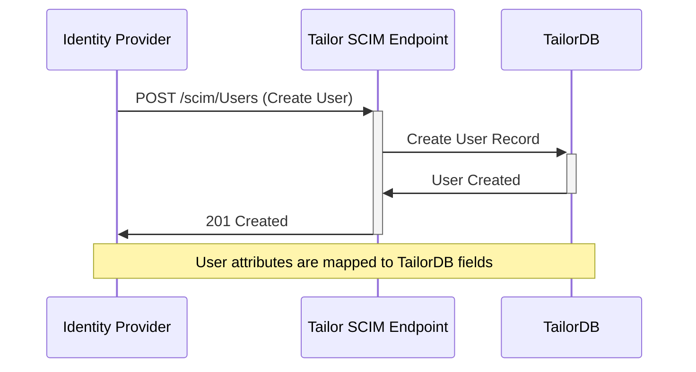

# SCIM Provisioning

SCIM (System for Cross-domain Identity Management) is an open standard that enables automatic user provisioning between your Identity Provider (IdP) and your Tailor Platform application. When configured, SCIM allows your IdP to automatically create, update, and deactivate user accounts in your application, eliminating the need for manual user management.

## What is SCIM?

SCIM provides a standardized way for identity providers like Okta, Microsoft Entra ID, and others to communicate user lifecycle events to your application. This includes creating new users when they join your organization, updating user information when it changes, and deactivating accounts when users leave.

The Tailor Platform implements SCIM 2.0, which uses a RESTful API with JSON payloads to manage user resources. When your IdP provisions a user, the SCIM endpoint receives the user data and automatically creates or updates the corresponding record in your TailorDB.



## Configuration Overview

Setting up SCIM provisioning requires three main components:

1. **Machine User**: A service account that performs provisioning operations on behalf of the IdP
2. **SCIM Configuration**: Defines the authentication method for SCIM requests
3. **Resource Mapping**: Maps SCIM schema attributes to your TailorDB fields

## Machine User Configuration

SCIM provisioning requires a dedicated machine user with appropriate permissions to create, update, and delete user records in your TailorDB. This machine user acts as the service account that executes all provisioning operations.

**SDK Configuration:**

```typescript
import { defineAuth } from "@tailor-platform/sdk";
import { user } from "./tailordb/user";

export const authConfig = defineAuth("my-auth", {
  userProfile: {
    type: user,
    usernameField: "email",
    attributes: {
      attrs: true,
    },
  },
  machineUsers: {
    "scim-user": {
      attributes: {
        attrs: ["admin"],
      },
    },
  },
  scim: {
    machineUserName: "scim-user",
    authorization: {
      type: "oauth2",
    },
    resources: [
      // Resource definitions (see below)
    ],
  },
});
```

The machine user should have sufficient permissions to perform CRUD operations on the TailorDB types that will store provisioned users. Typically, this means assigning an admin role or creating a specific role with the necessary permissions.

## Authentication Methods

The SCIM endpoint supports two authentication methods:

### OAuth2 Authentication

OAuth2 authentication uses the machine user's client credentials to authenticate SCIM requests. This is the recommended approach as it provides secure, token-based authentication.

**SDK Configuration:**

```typescript
scim: {
  machineUserName: "scim-user",
  authorization: {
    type: "oauth2",
  },
  // ...
}
```

When using OAuth2, your IdP will need to obtain an access token using the machine user's client credentials before making SCIM requests. The token endpoint is:

```
POST https://{APP_DOMAIN}/oauth2/token
```

### Bearer Token Authentication

Bearer token authentication uses a static secret token stored in Secret Manager. While simpler to configure, OAuth2 is generally preferred for production environments.

> **Note:** For SDK-based configuration, define the secret in your secrets configuration and reference it in the authorization settings. Consult the [Secret Manager documentation](/guides/secretmanager) for details on managing secrets.

## Resource Mapping

Resource mapping defines how SCIM attributes are translated to your TailorDB fields. Each SCIM resource corresponds to a TailorDB type and includes a schema definition and field mappings.

### Schema Definition

The schema definition describes the SCIM attributes that your endpoint accepts. The Tailor Platform supports the standard SCIM 2.0 User schema (`urn:ietf:params:scim:schemas:core:2.0:User`).

**SDK Configuration:**

```typescript
scim: {
  machineUserName: "scim-user",
  authorization: {
    type: "oauth2",
  },
  resources: [
    {
      name: "Users",
      tailorDBNamespace: "tailordb",
      tailorDBType: "User",
      coreSchema: {
        name: "urn:ietf:params:scim:schemas:core:2.0:User",
        attributes: [
          {
            type: "string",
            name: "userName",
            required: true,
          },
          {
            type: "complex",
            name: "emails",
            required: true,
            multiValued: true,
            subAttributes: [
              {
                type: "string",
                name: "value",
              },
              {
                type: "boolean",
                name: "primary",
              },
            ],
          },
        ],
      },
      attributeMapping: [
        { tailorDBField: "name", scimPath: "userName" },
        { tailorDBField: "email", scimPath: "emails.#(primary==true).value" },
      ],
    },
  ],
}
```

### Supported Attribute Types

SCIM attributes can be one of the following types:

| Type       | Description                         |
| ---------- | ----------------------------------- |
| `string`   | Text values                         |
| `boolean`  | True/false values                   |
| `number`   | Numeric values                      |
| `datetime` | ISO 8601 formatted date-time values |
| `complex`  | Nested objects with sub-attributes  |

### Multi-Valued Attributes

Many SCIM attributes are multi-valued, meaning they contain arrays of values. The `emails` attribute is a common example, where a user may have multiple email addresses with one marked as primary.

To handle multi-valued attributes, you can use path expressions in your attribute mapping:

| Path Expression                      | Description                          |
| ------------------------------------ | ------------------------------------ |
| `emails.0.value`                     | First email's value                  |
| `emails.#(primary==true).value`      | Value of the email marked as primary |
| `phoneNumbers.#(type=="work").value` | Work phone number value              |

The `#(condition)` syntax allows you to filter multi-valued attributes based on a condition, making it easy to extract specific values like the primary email address.

### Attribute Mapping

Attribute mapping connects SCIM schema attributes to your TailorDB fields. Each mapping specifies:

- **tailorDBField**: The field name in your TailorDB type
- **scimPath**: The path to the SCIM attribute value

```typescript
attributeMapping: [
  { tailorDBField: "name", scimPath: "userName" },
  { tailorDBField: "email", scimPath: "emails.#(primary==true).value" },
  { tailorDBField: "firstName", scimPath: "name.givenName" },
  { tailorDBField: "lastName", scimPath: "name.familyName" },
];
```

## Complete Example

Here is a complete example showing SCIM configuration with the Tailor Platform SDK:

```typescript
import { defineAuth } from "@tailor-platform/sdk";
import { user } from "./tailordb/user";
import { createIdProviderConfig } from "./idp";

const AUTH_NAMESPACE = "my-auth";

export const authConfig = defineAuth(AUTH_NAMESPACE, {
  userProfile: {
    type: user,
    usernameField: "email",
    attributes: {
      attrs: true,
    },
  },
  idProvider: createIdProviderConfig(),
  oauth2Clients: {
    "oauth2-client": {
      redirectURIs: ["https://myapp.example.com/callback"],
      grantTypes: ["authorization_code", "refresh_token"],
      clientType: "browser",
    },
  },
  machineUsers: {
    "machine-user": {
      attributes: {
        attrs: ["admin"],
      },
    },
    "scim-user": {
      attributes: {
        attrs: ["admin"],
      },
    },
  },
  scim: {
    machineUserName: "scim-user",
    authorization: {
      type: "oauth2",
    },
    resources: [
      {
        name: "Users",
        tailorDBNamespace: "tailordb",
        tailorDBType: "User",
        coreSchema: {
          name: "urn:ietf:params:scim:schemas:core:2.0:User",
          attributes: [
            {
              type: "string",
              name: "userName",
              required: true,
            },
            {
              type: "complex",
              name: "emails",
              required: true,
              multiValued: true,
              subAttributes: [
                {
                  type: "string",
                  name: "value",
                },
                {
                  type: "boolean",
                  name: "primary",
                },
              ],
            },
          ],
        },
        attributeMapping: [
          { tailorDBField: "name", scimPath: "userName" },
          { tailorDBField: "email", scimPath: "emails.#(primary==true).value" },
        ],
      },
    ],
  },
});
```

## SCIM Endpoint

Once configured, your SCIM endpoint will be available at:

```
https://{APP_DOMAIN}/scim/{AUTH_NAMESPACE}/v2
```

The endpoint supports the following operations:

| Method | Endpoint      | Description         |
| ------ | ------------- | ------------------- |
| GET    | `/Users`      | List all users      |
| GET    | `/Users/{id}` | Get a specific user |
| POST   | `/Users`      | Create a new user   |
| PUT    | `/Users/{id}` | Replace a user      |
| PATCH  | `/Users/{id}` | Update a user       |
| DELETE | `/Users/{id}` | Delete a user       |

## IdP-Specific Considerations

Different Identity Providers may send SCIM data in slightly different formats. When configuring your attribute mappings, consult your IdP's SCIM documentation to understand the exact payload structure it sends. Always test your SCIM configuration with your specific IdP to ensure proper attribute mapping.

## Troubleshooting

Common issues when setting up SCIM provisioning:

**Authentication failures**: Verify that your machine user credentials are correct and that the IdP is using the proper authentication method (OAuth2 or Bearer token).

**Attribute mapping errors**: If user data is not being stored correctly, check that your `attributeMapping` paths correctly reference the SCIM attributes sent by your IdP. Use your IdP's SCIM testing tools to inspect the actual payload format and verify that paths like `emails.#(primary==true).value` match the structure of the incoming data.

**Permission errors**: Ensure the SCIM machine user has sufficient permissions to create, update, and delete records in the target TailorDB type.

**Schema definition errors**: If SCIM requests are rejected, verify that required attributes in your `coreSchema` definition match what your IdP sends, and that the attribute types (string, boolean, complex, etc.) are correctly specified.
