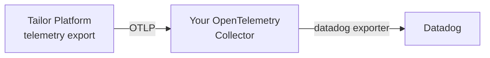

# Observability

Tailor Platform forwards the OpenTelemetry signals generated by your workspace to the observability backend of your choice.
By configuring a telemetry export, you can integrate platform-generated **traces** and **logs** with tools such as Datadog, Grafana, or Honeycomb, without changing any application code.

Common use cases include:

- Sending request traces from your platform services to an existing distributed tracing backend
- Centralizing platform logs alongside your application logs
- Enriching all outgoing signals with a consistent service name and deployment environment

Telemetry export is configured through the Tailor Terraform provider. There are two resources:

- `tailor_telemetryrouter_telemetry_export` — defines an export destination
- `tailor_telemetryrouter_resource_attributes_config` — defines workspace-level resource attributes that are attached to every signal

## How it works

TelemetryRouter routes signals per workspace. Each export destination you define receives the workspace's signals over OTLP (the OpenTelemetry Protocol), and you choose which signals each destination receives.

- Signals are routed per workspace to every enabled export destination.
- Traces and logs can be enabled independently per export.
- Authentication credentials are never stored inline — they are referenced from [Secret Manager](secretmanager.md) and resolved at send time.

**Metrics are not supported yet.** The `enable_metrics` field exists for forward compatibility, but the platform does not currently emit or forward metric signals. Enabling it has no effect today, so configure your destinations for traces and logs only.

## Configuring a telemetry export

A telemetry export defines a single destination. A workspace may have multiple exports, each identified by a unique `name`.

The following example forwards traces and logs to a generic OTLP backend over HTTP, authenticating with a bearer token stored in Secret Manager:

```hcl {{ title: 'telemetry_export.tf' }}
resource "tailor_telemetryrouter_telemetry_export" "backend" {
  workspace_id = tailor_workspace.example.id

  name     = "otlp-backend"
  endpoint = "https://otlp.example.com"
  protocol = "http"

  auth = {
    bearer_token = {
      secret_value = {
        vault_name  = tailor_secretmanager_vault.example.name
        secret_name = "otlp-backend-token"
      }
    }
  }

  enable_traces = true
  enable_logs   = true
}
```

To send telemetry to Datadog, route it through your own OpenTelemetry Collector. See [Exporting to Datadog](#exporting-to-datadog) below.

### Arguments

| Argument | Type | Required | Description |
| --- | --- | --- | --- |
| `workspace_id` | String | Yes | The ID of the workspace this export belongs to. |
| `name` | String | Yes | Unique name of the destination within the workspace. Must match the pattern `^[a-z0-9][a-z0-9-]{1,61}[a-z0-9]$` (3–63 characters, lowercase alphanumerics and hyphens, no leading or trailing hyphen). |
| `endpoint` | String | Yes | The OTLP endpoint to forward signals to. See [Endpoint format](#endpoint-format) for the rules. |
| `protocol` | String | Yes | The OTLP transport protocol. One of `grpc` or `http`. |
| `enabled` | Boolean | No | Whether this destination is active. Defaults to `true`. |
| `enable_traces` | Boolean | No | Whether to forward trace signals. Defaults to `false`. |
| `enable_logs` | Boolean | No | Whether to forward log signals. Defaults to `false`. |
| `enable_metrics` | Boolean | No | Reserved for future use. **Metrics are not supported yet** — see [How it works](#how-it-works). Defaults to `false`. |
| `headers` | Map of String | No | Additional headers attached to each outgoing request. |
| `auth` | Block | No | Authentication for the endpoint. Exactly one of `api_key` or `bearer_token` may be set. |

### Authentication

The optional `auth` block configures how Tailor authenticates to the destination. Set **exactly one** of the following.

**API key** — the secret value is sent in the header you name:

```hcl {{ title: 'auth_api_key.tf' }}
auth = {
  api_key = {
    header_name = "x-api-key"
    secret_value = {
      vault_name  = tailor_secretmanager_vault.example.name
      secret_name = "backend-api-key"
    }
  }
}
```

**Bearer token** — the secret value is sent as an `Authorization: Bearer <token>` header:

```hcl {{ title: 'auth_bearer.tf' }}
auth = {
  bearer_token = {
    secret_value = {
      vault_name  = tailor_secretmanager_vault.example.name
      secret_name = "backend-token"
    }
  }
}
```

In both cases `secret_value` references a secret in [Secret Manager](secretmanager.md):

- `vault_name` — the name of the vault that stores the secret
- `secret_name` — the key of the secret within the vault

## Endpoint format

The connection to the destination must use TLS; plain `http://` is not supported. The required `endpoint` format depends on the `protocol`:

- **`http`** — an HTTPS base URL, for example `https://otlp.example.com`. Do **not** include the OTLP signal path (`/v1/traces`, `/v1/metrics`, `/v1/logs`); it is appended automatically for each enabled signal. Query strings and fragments are not allowed.
- **`grpc`** — either a bare `host:port` (the port is **required**, for example `otlp.example.com:4317`) or an `https://host[:port]` URL (the port defaults to `443` when omitted). A path, query string, or fragment is not allowed.

Endpoints that resolve to a private or internal host (for example RFC 1918 ranges or loopback addresses) are rejected by default.

| Protocol | Valid | Invalid |
| --- | --- | --- |
| `http` | `https://otlp.example.com` | `https://otlp.example.com/v1/traces` (signal path), `http://otlp.example.com` (not TLS) |
| `grpc` | `otlp.example.com:4317`, `https://otlp.example.com` | `otlp.example.com` (no port), `https://otlp.example.com/path` (has path) |

## Exporting to Datadog

Datadog cannot currently be used as a direct telemetry export target. Instead, run your own OpenTelemetry Collector with the [Datadog exporter](https://github.com/open-telemetry/opentelemetry-collector-contrib/tree/main/exporter/datadogexporter) configured, point your Tailor telemetry export at that collector, and let the collector forward signals to Datadog.



### 1. Configure your OpenTelemetry Collector

Run an OpenTelemetry Collector that receives OTLP from Tailor and exports to Datadog. A minimal configuration:

```yaml {{ title: 'otel-collector.yaml' }}
receivers:
  otlp:
    protocols:
      grpc:
        endpoint: 0.0.0.0:4317

processors:
  batch: {}

exporters:
  datadog:
    api:
      key: ${env:DD_API_KEY}
      site: datadoghq.com

service:
  pipelines:
    traces:
      receivers: [otlp]
      processors: [batch]
      exporters: [datadog]
    logs:
      receivers: [otlp]
      processors: [batch]
      exporters: [datadog]
```

This collector must be reachable from Tailor over TLS at a publicly resolvable address. Terminate TLS in front of the collector (for example with a load balancer) and expose its OTLP gRPC endpoint.

### 2. Point the telemetry export at your collector

Configure the export `endpoint` to your collector's OTLP endpoint rather than Datadog directly:

```hcl {{ title: 'datadog_export.tf' }}
resource "tailor_telemetryrouter_telemetry_export" "datadog" {
  workspace_id = tailor_workspace.example.id

  name     = "datadog-collector"
  endpoint = "otel-collector.example.com:4317"
  protocol = "grpc"

  enable_traces = true
  enable_logs   = true
}
```

If your collector requires authentication, add an `auth` block or `headers` as described in [Authentication](#authentication). Because the endpoint points at your own collector, make sure it is not a private or internal host — see [Endpoint format](#endpoint-format).

## Configuring resource attributes

The `tailor_telemetryrouter_resource_attributes_config` resource defines workspace-level resource attributes that are attached to every outgoing signal. It is a singleton: a workspace has at most one resource attributes configuration.

```hcl {{ title: 'resource_attributes.tf' }}
resource "tailor_telemetryrouter_resource_attributes_config" "this" {
  workspace_id = tailor_workspace.example.id

  service_name_prefix         = "acme"
  deployment_environment_name = "production"
}
```

### Arguments

| Argument | Type | Required | Description |
| --- | --- | --- | --- |
| `workspace_id` | String | Yes | The ID of the workspace this configuration belongs to. |
| `service_name_prefix` | String | Yes | Prefix prepended to each microservice's own `service.name` to form the final `service.name` attribute on outgoing signals (`<service_name_prefix>-<service.name>`). Must match the pattern `^[a-z0-9][a-z0-9-]{1,61}[a-z0-9]$`. |
| `deployment_environment_name` | String | No | Customer-side deployment environment (for example `production` or `staging`), following the OpenTelemetry semantic convention `deployment.environment.name`. Maximum 256 characters. When omitted, the attribute is left untouched. |

## Security considerations

- Authentication credentials are referenced from [Secret Manager](secretmanager.md), never stored inline in the export configuration.
- Secret values are write-only when managed through Terraform and are never exposed in state files or logs.
- The destination connection must use TLS; plaintext `http://` endpoints are rejected.

## Best practices

1. **Separate environments**: Use distinct exports (and Secret Manager vaults) per environment, and set `deployment_environment_name` accordingly.
2. **Enable only the signals you need**: Leave `enable_traces` / `enable_logs` off for destinations that should not receive a given signal.
3. **Use a consistent service name prefix**: Set `service_name_prefix` so platform signals are easy to identify in your backend.
4. **Rotate credentials**: Update the referenced secret values when rotating API keys or tokens.
