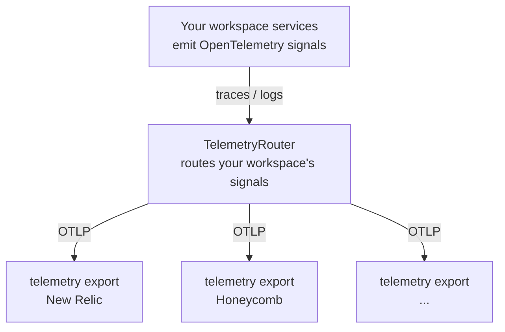
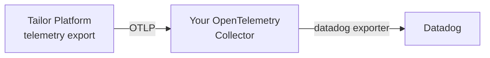

# Observability / OpenTelemetry

Tailor Platform automatically generates [OpenTelemetry](https://github.com/open-telemetry/opentelemetry-specification) signals — **traces** and **logs** — for the services in your workspace. By configuring a **telemetry export**, you can forward those signals to the observability backend of your choice, such as New Relic, Honeycomb, Grafana, or Datadog, without changing any application code.

This is different from inspecting logs in the Tailor console: the [console](/getting-started/console/overview) lets you view pipeline execution logs inside the platform, while this guide is about **forwarding signals to an external backend** that you operate.

Common use cases include:

- Sending request traces from your platform services to an existing distributed tracing backend
- Centralizing platform logs alongside your application logs
- Enriching all outgoing signals with a consistent service name and deployment environment

## How telemetry export works

The platform collects the OpenTelemetry signals your services emit and forwards them, over OTLP (the OpenTelemetry Protocol), to each **telemetry export** you have configured. A telemetry export is the resource *you* define — it points at one backend and decides which signals that backend receives. The internal platform component that performs this routing is **TelemetryRouter**; you don't configure it directly, but it is the source of the `tailor_telemetryrouter_` prefix on the resources below.



You configure telemetry export through the Tailor Terraform provider. There are two resources:

- `tailor_telemetryrouter_telemetry_export` — defines an export destination. A workspace may have many; each is given a `name` that is unique within that workspace.
- `tailor_telemetryrouter_resource_attributes_config` — defines workspace-level resource attributes attached to every outgoing signal. A workspace has at most one.

A few things to keep in mind:

- **Traces and logs can be enabled independently** per export, so each destination receives only the signals you choose.
- **Authentication credentials are never stored inline** — they are referenced from [Secret Manager](secretmanager.md) and resolved at send time.

::: warning Metrics
Metric signals are not part of telemetry export today. While the `enable_metrics` field exists, the platform does not currently emit metric signals, so enabling it has no practical effect. Configure your destinations for traces and logs.
:::

## Configuring a telemetry export

A telemetry export defines a single destination. Most OTLP-compatible backends can be targeted **directly**, with no additional infrastructure on your side.

The following example forwards traces and logs to [New Relic](https://github.com/newrelic), authenticating with a license key stored in Secret Manager:

```hcl {{ title: 'telemetry_export.tf' }}
resource "tailor_telemetryrouter_telemetry_export" "newrelic" {
  workspace_id = tailor_workspace.example.id

  name     = "newrelic"
  endpoint = "https://otlp.nr-data.net"
  protocol = "http"

  auth = {
    api_key = {
      header_name = "api-key"
      secret_value = {
        vault_name  = tailor_secretmanager_vault.example.name
        secret_name = "newrelic-license-key"
      }
    }
  }

  enable_traces = true
  enable_logs   = true
}
```

For more backends — including ones that cannot ingest OTLP directly, such as Datadog — see [Backend examples](#backend-examples).

For the full list of arguments and their constraints, refer to the [Tailor Platform Provider documentation](https://registry.terraform.io/providers/tailor-platform/tailor/latest/docs/resources/telemetryrouter_telemetry_export).

### Authentication

The optional `auth` block configures how Tailor authenticates to the destination. Set **exactly one** of the following.

**API key** — the secret value is sent in the header you name:

```hcl {{ title: 'auth_api_key.tf' }}
auth = {
  api_key = {
    header_name = "x-api-key"
    secret_value = {
      vault_name  = tailor_secretmanager_vault.example.name
      secret_name = "backend-api-key"
    }
  }
}
```

**Bearer token** — the secret value is sent as an `Authorization: Bearer <token>` header:

```hcl {{ title: 'auth_bearer.tf' }}
auth = {
  bearer_token = {
    secret_value = {
      vault_name  = tailor_secretmanager_vault.example.name
      secret_name = "backend-token"
    }
  }
}
```

In both cases `secret_value` references a secret in [Secret Manager](secretmanager.md):

- `vault_name` — the name of the vault that stores the secret
- `secret_name` — the key of the secret within the vault

## Endpoint format

Use a TLS-enabled endpoint (HTTPS) so credentials and signals are encrypted in transit; plaintext endpoints are not recommended, and a plaintext gRPC target fails to connect. The required `endpoint` format depends on the `protocol`:

- **`http`** — an HTTPS base URL, for example `https://otlp.example.com`. Do **not** include the OTLP signal path (`/v1/traces`, `/v1/logs`); it is appended automatically for each enabled signal. Avoid query strings and fragments.
- **`grpc`** — either a bare `host:port` (include the port, for example `otlp.example.com:4317`) or an `https://host[:port]` URL (the port defaults to `443` when omitted). Do not include a path, query string, or fragment.

Endpoints that resolve to a private or internal host (for example RFC 1918 ranges or loopback addresses) are rejected by default.

| Protocol | Recommended | Avoid |
| --- | --- | --- |
| `http` | `https://otlp.example.com` | `https://otlp.example.com/v1/traces` (signal path), `http://otlp.example.com` (not TLS) |
| `grpc` | `otlp.example.com:4317`, `https://otlp.example.com` | `otlp.example.com` (no port), `https://otlp.example.com/path` (has path) |

## Backend examples

### New Relic

New Relic ingests OTLP directly. Point the export at its OTLP endpoint and authenticate with a license key sent in the `api-key` header — see the [example above](#configuring-a-telemetry-export). Use the OTLP endpoint for your account's region (for example `https://otlp.nr-data.net` for US or `https://otlp.eu01.nr-data.net` for EU).

### Honeycomb

[Honeycomb](https://github.com/honeycombio) also ingests OTLP directly. Authenticate with an API key sent in the `x-honeycomb-team` header:

```hcl {{ title: 'honeycomb_export.tf' }}
resource "tailor_telemetryrouter_telemetry_export" "honeycomb" {
  workspace_id = tailor_workspace.example.id

  name     = "honeycomb"
  endpoint = "https://api.honeycomb.io"
  protocol = "http"

  auth = {
    api_key = {
      header_name = "x-honeycomb-team"
      secret_value = {
        vault_name  = tailor_secretmanager_vault.example.name
        secret_name = "honeycomb-api-key"
      }
    }
  }

  enable_traces = true
  enable_logs   = true
}
```

Use the endpoint for your account's region (for example `https://api.honeycomb.io` for US or `https://api.eu1.honeycomb.io` for EU).

### Routing through an OpenTelemetry Collector (Datadog)

Datadog provides a [direct OTLP intake endpoint](https://docs.datadoghq.com/opentelemetry/setup/otlp_ingest/), but it comes with constraints — trace intake is in preview and requires requesting access, and some behavior differs from the Agent/Collector path. For a full-featured setup, a common approach is to run your own [OpenTelemetry Collector](https://github.com/open-telemetry/opentelemetry-collector) with the Datadog exporter: point your Tailor telemetry export at the collector and let it forward signals to Datadog.

This collector pattern applies to any backend you'd rather reach through a collector — for processing, fan-out, or vendor-specific exporters — not just Datadog.



#### 1. Configure your OpenTelemetry Collector

Run an OpenTelemetry Collector that receives OTLP from Tailor and exports to Datadog. A minimal configuration:

```yaml {{ title: 'otel-collector.yaml' }}
receivers:
  otlp:
    protocols:
      grpc:
        endpoint: 0.0.0.0:4317

processors:
  batch: {}

exporters:
  datadog:
    api:
      key: ${env:DD_API_KEY}
      site: datadoghq.com

service:
  pipelines:
    traces:
      receivers: [otlp]
      processors: [batch]
      exporters: [datadog]
    logs:
      receivers: [otlp]
      processors: [batch]
      exporters: [datadog]
```

This collector must be reachable from Tailor over TLS at a publicly resolvable address. Terminate TLS in front of the collector (for example with a load balancer) and expose its OTLP gRPC endpoint.

#### 2. Point the telemetry export at your collector

Configure the export `endpoint` to your collector's OTLP endpoint rather than Datadog directly:

```hcl {{ title: 'datadog_export.tf' }}
resource "tailor_telemetryrouter_telemetry_export" "datadog" {
  workspace_id = tailor_workspace.example.id

  name     = "datadog-collector"
  endpoint = "otel-collector.example.com:4317"
  protocol = "grpc"

  enable_traces = true
  enable_logs   = true
}
```

If your collector requires authentication, add an `auth` block as described in [Authentication](#authentication) so the credentials stay in Secret Manager. (The `headers` map can carry static, non-secret headers, but its values are persisted in Terraform state, so don't put credentials there.) Because the endpoint points at your own collector, make sure it is not a private or internal host — see [Endpoint format](#endpoint-format).

## Configuring resource attributes

The `tailor_telemetryrouter_resource_attributes_config` resource defines workspace-level resource attributes that are attached to every outgoing signal. It is a singleton: a workspace has at most one resource attributes configuration.

```hcl {{ title: 'resource_attributes.tf' }}
resource "tailor_telemetryrouter_resource_attributes_config" "this" {
  workspace_id = tailor_workspace.example.id

  service_name_prefix         = "acme"
  deployment_environment_name = "production"
}
```

`service_name_prefix` is prepended to each microservice's own `service.name` to form the final `service.name` attribute on outgoing signals (`<service_name_prefix>-<service.name>`), making platform signals easy to identify in your backend. `deployment_environment_name` follows the OpenTelemetry semantic convention `deployment.environment.name`.

For the full list of arguments and their constraints, refer to the [Tailor Platform Provider documentation](https://registry.terraform.io/providers/tailor-platform/tailor/latest/docs/resources/telemetryrouter_resource_attributes_config).

## Security considerations

- Prefer the `auth` block for credentials: it references secrets in [Secret Manager](secretmanager.md), so the secret values themselves are never stored in the export configuration or in Terraform state.
- The `headers` map is marked sensitive (redacted from Terraform plan and diff output), but its values are still persisted in Terraform state. Use it only for non-secret, static headers — put credentials in the `auth` block instead.
- Use TLS-enabled (HTTPS) endpoints so credentials and signals are encrypted in transit. Endpoints that resolve to a private or internal host are rejected.

## Best practices

1. **Separate environments**: Use distinct exports (and Secret Manager vaults) per environment, and set `deployment_environment_name` accordingly.
2. **Enable only the signals you need**: Leave `enable_traces` / `enable_logs` off for destinations that should not receive a given signal.
3. **Use a consistent service name prefix**: Set `service_name_prefix` so platform signals are easy to identify in your backend.
4. **Rotate credentials**: Update the referenced secret values when rotating API keys or tokens.
