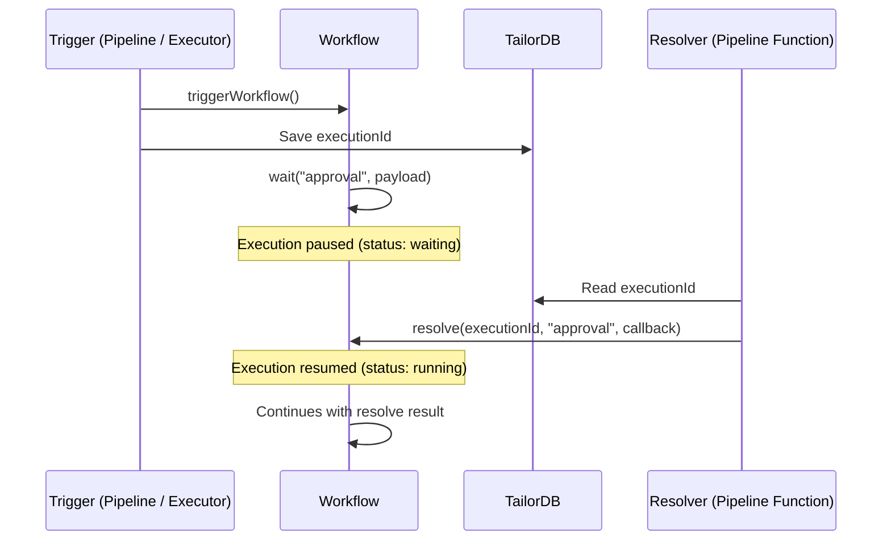
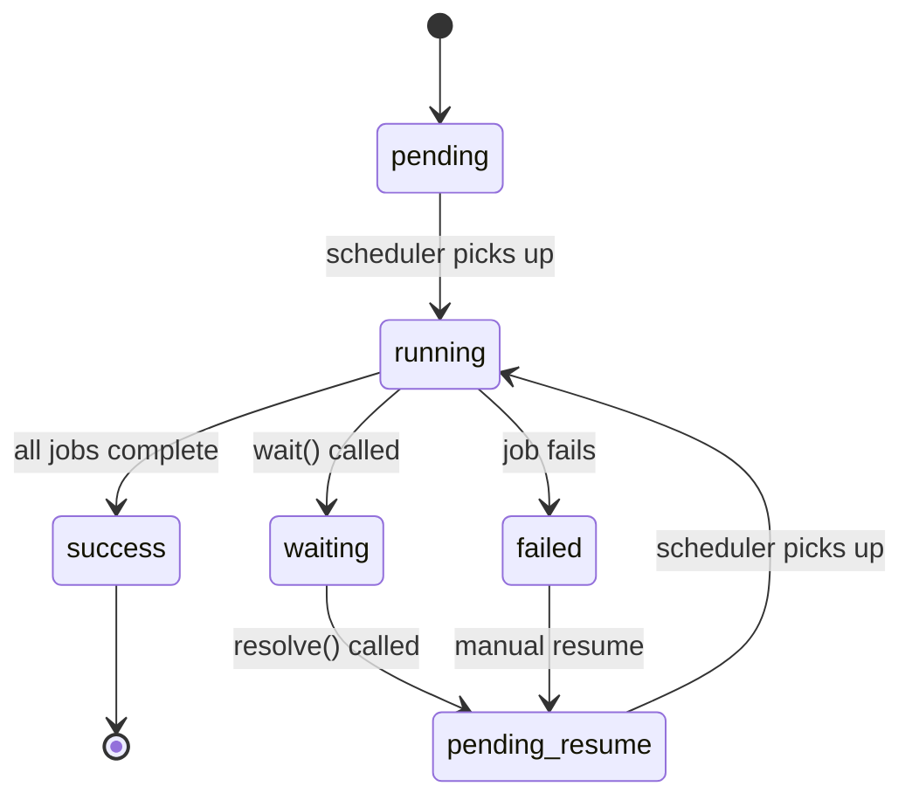

# Wait / Resolve

## Overview

The Wait / Resolve API enables **human-in-the-loop** patterns in workflows. A workflow can pause execution at any point and wait for an external signal before resuming, without consuming resources while waiting.

This is useful for scenarios where a workflow needs to wait for:

- Manual approval (e.g., order approval, content review)
- External system completion (e.g., payment confirmation)
- User input or decision before proceeding

## How It Works

The Wait / Resolve flow consists of three phases:

1. **Trigger** — A workflow is triggered and starts executing
2. **Wait** — The workflow calls `wait()`, which suspends execution and parks it in the database
3. **Resolve** — Another script calls `resolve()` with the execution ID and key, which resumes the workflow



While waiting, the workflow runner exits and no resources are consumed. The execution is parked in the database until `resolve()` is called.

## API Reference

### `tailor.workflow.wait(key, payload)`

Suspends the current workflow execution and waits for an external signal.

**Arguments:**

- **`key`** (string, required) — A unique identifier for this wait point within the workflow. Must match the pattern `^[a-z0-9][a-z0-9-]{1,61}[a-z0-9]$` (lowercase alphanumeric with hyphens, 3–63 characters).
- **`payload`** (object, optional) — JSON-serializable data to persist while waiting. This data is available to the `resolve()` callback. Defaults to `{}` if omitted.

**Return value:**

- The result returned by the `resolve()` callback when the workflow resumes.

**Example:**

```javascript
export async function main(args) {
  const order = tailor.workflow.triggerJobFunction("createOrder", args);

  // Pause and wait for approval
  const approval = await tailor.workflow.wait("approval", {
    orderId: order.id,
    amount: order.totalAmount,
    requestedBy: args.userId,
  });

  if (approval.approved) {
    tailor.workflow.triggerJobFunction("fulfillOrder", {
      orderId: order.id,
    });
  }

  return { orderId: order.id, approved: approval.approved };
}
```

### `tailor.workflow.resolve(executionId, key, callback)`

Resolves a waiting workflow, causing it to resume execution.

**Arguments:**

- **`executionId`** (string, required) — The execution ID of the waiting workflow.
- **`key`** (string, required) — The wait key to resolve. Must match the key passed to `wait()`.
- **`callback`** (function, required) — A function that receives the `waitPayload` (the data passed to `wait()`) and returns a JSON-serializable result. The returned value is passed back to the `wait()` caller when the workflow resumes.

**Return value:**

- None. The callback result is delivered to the waiting workflow asynchronously.

**Example:**

```javascript
export async function main(args) {
  await tailor.workflow.resolve(
    args.executionId,
    "approval",
    (waitPayload) => {
      // waitPayload contains the data passed to wait()
      // e.g., { orderId: "...", amount: 1000, requestedBy: "..." }
      return {
        approved: args.approved,
        approvedBy: args.approverId,
        approvedAt: new Date().toISOString(),
      };
    },
  );
}
```

## Typical Pattern

A common implementation pattern involves three components:

1. **A workflow** that triggers processing and pauses with `wait()`
2. **A TailorDB record** that stores the execution ID for later retrieval
3. **A pipeline resolver function** that calls `resolve()` when the human decision is made

### Step 1: Trigger the workflow and save the execution ID

```javascript
// Pipeline resolver or executor function
export async function main(args) {
  const executionId = await tailor.workflow.triggerWorkflow(
    "order-approval-workflow",
    { orderId: args.orderId },
  );

  // Save executionId to TailorDB for later retrieval
  await gql.mutation({
    updateOrder: {
      __args: {
        id: args.orderId,
        input: { workflowExecutionId: executionId },
      },
      id: true,
    },
  });

  return { executionId };
}
```

### Step 2: Workflow pauses with `wait()`

```javascript
// Workflow job function
export async function main(args) {
  const order = tailor.workflow.triggerJobFunction("prepareOrder", args);

  // Pause and wait for human approval
  const decision = await tailor.workflow.wait("approval", {
    orderId: order.id,
    items: order.items,
    total: order.total,
  });

  // Resume after approval
  if (decision.approved) {
    tailor.workflow.triggerJobFunction("processOrder", {
      orderId: order.id,
    });
  }

  return { status: decision.approved ? "completed" : "rejected" };
}
```

### Step 3: Resolve from a pipeline resolver function

```javascript
// Pipeline resolver function called when an approver submits their decision
export async function main(args) {
  // Retrieve the execution ID from TailorDB
  const order = await gql.query({
    order: {
      __args: { id: args.orderId },
      workflowExecutionId: true,
    },
  });

  // Resolve the waiting workflow
  await tailor.workflow.resolve(
    order.workflowExecutionId,
    "approval",
    (waitPayload) => {
      return {
        approved: args.approved,
        approvedBy: args.approverId,
      };
    },
  );
}
```

## Execution Status

When a workflow calls `wait()`, the execution status transitions to **waiting**:



You can check the waiting status using the CLI:

```bash
tailor-sdk workflow executions --status WAITING
```

## Key Behaviors

- **No resource consumption while waiting** — The workflow runner exits when `wait()` is called. The execution is parked in the database.
- **Durable state** — The wait payload and all previous job function results are preserved across the wait/resume cycle.
- **Key matching** — The `key` in `resolve()` must exactly match the `key` in `wait()`. A mismatched key results in an error.
- **Single resolve** — Each wait point can only be resolved once. Concurrent resolve attempts for the same execution and key are safely rejected.
- **Cache-aware** — Wait results are integrated into the durable execution cache. If a resumed workflow is later retried, the cached wait result is reused without requiring another `resolve()`.
