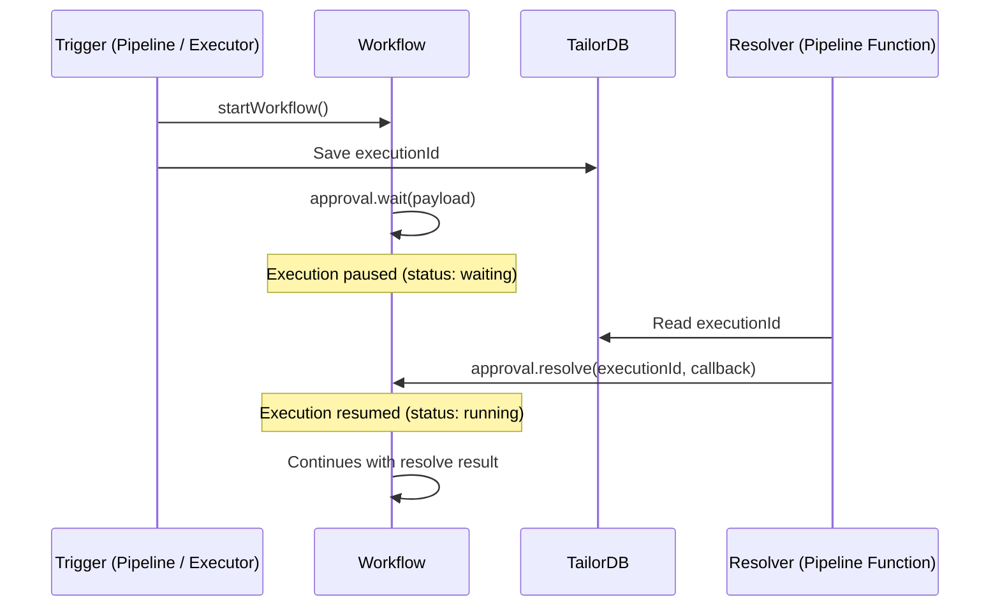
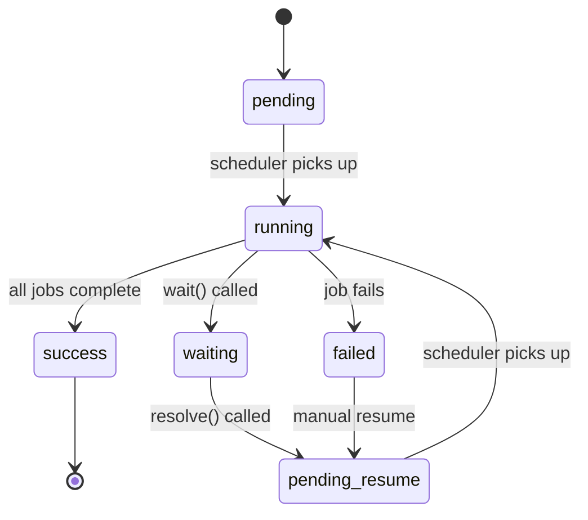

# Wait / Resolve

## Overview

The Wait / Resolve API enables **human-in-the-loop** patterns in workflows. A workflow can pause execution at any point and wait for an external signal before resuming, without consuming resources while waiting.

This is useful for scenarios where a workflow needs to wait for:

- Manual approval (e.g., order approval, content review)
- External system completion (e.g., payment confirmation)
- User input or decision before proceeding

## How It Works

The Wait / Resolve flow consists of three phases:

1. **Start** — A workflow is started and begins executing
2. **Wait** — The workflow job calls a wait point's `.wait()` method, which suspends execution and parks it in the database
3. **Resolve** — Another script calls the same wait point's `.resolve()` method with the execution ID, which resumes the workflow


```mermaid
sequenceDiagram
    participant Trigger as Trigger (Pipeline / Executor)
    participant Workflow as Workflow
    participant DB as TailorDB
    participant Resolver as Resolver (Pipeline Function)

    Trigger->>Workflow: startWorkflow()
    Trigger->>DB: Save executionId
    Workflow->>Workflow: approval.wait(payload)
    Note over Workflow: Execution paused (status: waiting)

    Resolver->>DB: Read executionId
    Resolver->>Workflow: approval.resolve(executionId, callback)
    Note over Workflow: Execution resumed (status: running)
    Workflow->>Workflow: Continues with resolve result
```

While waiting, the workflow runner exits and no resources are consumed. The execution is parked in the database until `.resolve()` is called.

## API Reference

Wait points are declared with `createWaitPoint` (single) or `createWaitPoints` (multiple, via a builder callback) from `@tailor-platform/sdk`. Each returns an object with `.wait()` and `.resolve()` methods, typed by a `Payload` (sent to `.wait()`) and a `Result` (returned from `.wait()`, produced by the `.resolve()` callback) — both must be JSON-serializable values.

```typescript {{ title: 'workflows/approval.ts' }}
import { createWaitPoint } from "@tailor-platform/sdk";

export const approval = createWaitPoint<
  { orderId: string; amount: number; requestedBy: string },
  { approved: boolean }
>("approval");
```

### `wait(payload)`

Suspends the current workflow job and waits for an external signal.

**Arguments:**

- **`payload`** (optional) — JSON-serializable data to persist while waiting. This data is available to the `.resolve()` callback. Omit if the wait point's `Payload` type is `undefined`.

**Return value:**

- The result returned by the `.resolve()` callback when the workflow resumes.

**Example:**

```typescript {{ title: 'workflows/jobs/process-order.ts' }}
import { createWorkflowJob } from "@tailor-platform/sdk";
import { approval } from "../approval";

export const processOrder = createWorkflowJob({
  name: "process-order",
  body: async (input: { orderId: string; totalAmount: number; userId: string }) => {
    const order = { id: input.orderId };

    // Pause and wait for approval
    const result = await approval.wait({
      orderId: order.id,
      amount: input.totalAmount,
      requestedBy: input.userId,
    });

    if (!result.approved) {
      return { orderId: order.id, status: "rejected" as const };
    }
    return { orderId: order.id, status: "approved" as const };
  },
});
```

### `resolve(executionId, callback)`

Resolves a waiting workflow, causing it to resume execution.

**Arguments:**

- **`executionId`** (string, required) — The execution ID of the waiting workflow.
- **`callback`** (function, required) — A function that receives the payload passed to `.wait()` and returns the `Result`. The returned value is passed back to the `.wait()` caller when the workflow resumes.

**Return value:**

- None. The callback result is delivered to the waiting workflow asynchronously.

**Example:**

```typescript {{ title: 'resolvers/resolveApproval.ts' }}
import { createResolver, t } from "@tailor-platform/sdk";
import { approval } from "../workflows/approval";

export default createResolver({
  name: "resolveApproval",
  operation: "mutation",
  input: {
    executionId: t.string(),
    approved: t.bool(),
  },
  body: async ({ input }) => {
    await approval.resolve(input.executionId, (payload) => {
      // payload contains the data passed to wait()
      // e.g., { orderId: "...", amount: 1000, requestedBy: "..." }
      return { approved: input.approved };
    });
    return { resolved: true };
  },
  output: t.object({ resolved: t.bool() }),
});
```

Wait points can be imported and used in any file (workflow jobs, resolvers, executors).

## Typical Pattern

A common implementation pattern involves three components:

1. **A workflow** that starts processing and pauses on a wait point's `.wait()`
2. **A TailorDB record** that stores the execution ID for later retrieval
3. **A pipeline resolver function** that calls the wait point's `.resolve()` when the human decision is made

### Step 1: Start the workflow and save the execution ID

```javascript
// Pipeline resolver or executor function
export async function main(args) {
  const executionId = await tailor.workflow.startWorkflow(
    "order-approval-workflow",
    { orderId: args.orderId },
  );

  // Save executionId to TailorDB for later retrieval
  await gql.mutation({
    updateOrder: {
      __args: {
        id: args.orderId,
        input: { workflowExecutionId: executionId },
      },
      id: true,
    },
  });

  return { executionId };
}
```

### Step 2: Workflow pauses on `approval.wait()`

```typescript {{ title: 'workflows/jobs/prepare-order.ts' }}
import { createWorkflowJob } from "@tailor-platform/sdk";
import { approval } from "../approval";

export const prepareOrder = createWorkflowJob({
  name: "prepare-order",
  body: async (input: { orderId: string; items: unknown[]; total: number }) => {
    // Pause and wait for human approval
    const decision = await approval.wait({
      orderId: input.orderId,
      items: input.items,
      total: input.total,
    });

    return { status: decision.approved ? "completed" : "rejected" };
  },
});
```

### Step 3: Resolve from a pipeline resolver function

```typescript {{ title: 'resolvers/resolveApproval.ts' }}
import { createResolver, t } from "@tailor-platform/sdk";
import { getDB } from "../generated/tailordb";
import { approval } from "../workflows/approval";

export default createResolver({
  name: "resolveApproval",
  operation: "mutation",
  input: {
    orderId: t.uuid(),
    approved: t.bool(),
  },
  body: async ({ input }) => {
    // Retrieve the execution ID from TailorDB
    const db = getDB("tailordb");
    const order = await db
      .selectFrom("Order")
      .select("workflowExecutionId")
      .where("id", "=", input.orderId)
      .executeTakeFirstOrThrow();

    // Resolve the waiting workflow
    await approval.resolve(order.workflowExecutionId, (payload) => {
      return { approved: input.approved };
    });

    return { resolved: true };
  },
  output: t.object({ resolved: t.bool() }),
});
```

## Execution Status

When a workflow calls `wait()`, the execution status transitions to **waiting**:


```mermaid
stateDiagram-v2
    [*] --> pending
    pending --> running : scheduler picks up

    running --> success : all jobs complete
    running --> waiting : wait() called
    running --> failed : job fails

    waiting --> pending_resume : resolve() called

    failed --> pending_resume : manual resume

    pending_resume --> running : scheduler picks up

    success --> [*]
```

You can check the waiting status using the CLI:

```bash
tailor workflow executions --status WAITING
```

## Key Behaviors

- **No resource consumption while waiting** — The workflow runner exits when `wait()` is called. The execution is parked in the database.
- **Durable state** — The wait payload and all previous job function results are preserved across the wait/resume cycle.
- **Key matching** — Each wait point has its own key (the string passed to `createWaitPoint`, or the property name under `createWaitPoints`). Resolving requires importing and calling `.resolve()` on that same wait point value — you can't resolve a suspended execution against a different wait point.
- **Single resolve** — Each wait point can only be resolved once. Concurrent resolve attempts for the same execution and key are safely rejected.
- **Cache-aware** — Wait results are integrated into the durable execution cache. If a resumed workflow is later retried, the cached wait result is reused without requiring another `resolve()`.
