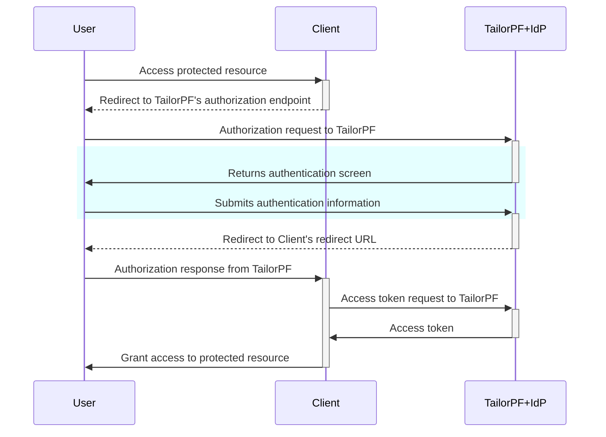

# Create Users in Your Application

In the authentication process, the user authenticates through the Identity Provider (IdP), which verifies their identity.
Once successfully authenticated, TailorPF queries its database to check if the user’s account already exists.

If the user’s account exists, TailorPF issues an access token, granting the user the appropriate level of access to the requested application based on their roles and permissions.

Here is a diagram that explains the flow of the authentication process.
From the client's perspective, the authorization flow is as shown below and uses TailorPF as the authorization server with the Authorization Code Grant.



## Steps to Create Users

### 1. Create a user in Auth0

Log in to your Auth0 account. In the `Dashboard`, navigate to `User management` and then select `Users`.
Click `Create User` to create a new user.


### 2. Use a GraphQL query to create a user in the TailorDB

Get an access token to use it in the GraphQL playground to run queries.

Run the following command to get an access token:

```bash
tailor-sdk machineuser token admin-machine-user
```

Set the token in the Headers section of the playground as follows:

```json
{
  "Authorization": "bearer {ACCESS_TOKEN}"
}
```

Query the roles to assign a role to the user.

```graphql {{title:'query'}}
query {
  roles {
    edges {
      node {
        id
        name
      }
    }
  }
}
```

You can assign the user a role using its ID.

```graphql {{title:'response'}}
{
  "data": {
    "roles": {
      "edges": [
        {
          "node": {
          	"id": "422e0d2d-fb14-458b-bbb2-db307fc1a174",
            "name": "Admin"
          }
        },
        {
          "node": {
            "id": "f1292168-f6de-405a-9f5a-c674a239da93",
            "name": "Editor"
          }
        }
      ]
    }
  }
}
```

Create a user with the email address used in step 1 and assign the 'Editor' role.

```graphql {{title:'query'}}
mutation {
  createUser(
    input: {
      name: "<username>"
      email: "<user-email>"
      roles: ["f1292168-f6de-405a-9f5a-c674a239da93"]
    }
  ) {
    id
  }
}
```

The user is created and can now access the application.

## Next steps

- [Create an OAuth2 client](create-oauth2-client) to securely log in to the application.
- Log in manually using [ID tokens](id-token).
